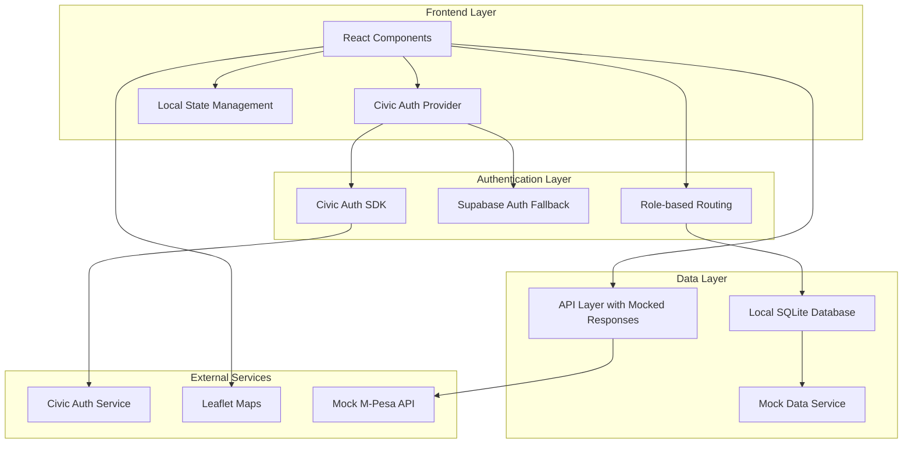

# Design Document

## Overview

The Civic Auth Marketplace is a comprehensive house repair and cleaning services platform designed for the African market, specifically Kenya. The system integrates Civic Auth for secure decentralized authentication while maintaining traditional email/password fallback. The application uses a local SQLite database for development testing and implements comprehensive mock data to simulate a fully functional marketplace.

The platform serves two primary user types:
- **Clients**: Users seeking house repair and cleaning services
- **Service Providers**: Individual contractors offering repair and cleaning services

## Architecture

### High-Level Architecture



### Technology Stack

- **Frontend**: React 18+ with TypeScript
- **Styling**: Tailwind CSS with shadcn/ui components
- **Authentication**: Civic Auth SDK + Supabase Auth (fallback)
- **Database**: SQLite (local development) + Supabase (production fallback)
- **Maps**: Leaflet with OpenStreetMap
- **State Management**: React Context + Custom Hooks
- **Build Tool**: Vite
- **Deployment**: Netlify

## Components and Interfaces

### Authentication Components

#### CivicAuthProvider
```typescript
interface CivicAuthProviderProps {
  clientId: string;
  children: React.ReactNode;
  onSignIn?: (user: CivicUser) => void;
  onSignOut?: () => void;
  displayMode?: 'iframe' | 'redirect' | 'new_tab';
}
```

#### Enhanced AuthPage Component
```typescript
interface AuthPageProps {
  defaultTab?: 'signin' | 'signup' | 'civic';
}

interface AuthFormData {
  email: string;
  password: string;
  full_name: string;
  phone_number: string;
  location: string;
  user_type: 'client' | 'provider';
}
```

### Marketplace Components

#### ServiceProviderCard
```typescript
interface ServiceProvider {
  id: string;
  name: string;
  service_type: string;
  location: string;
  rating: number;
  price_range: string;
  avatar_url?: string;
  description: string;
  availability: boolean;
  services_offered: string[];
}
```

#### BookingFlow Components
```typescript
interface Booking {
  id: string;
  client_id: string;
  provider_id: string;
  service_type: string;
  scheduled_date: string;
  scheduled_time: string;
  status: 'pending' | 'confirmed' | 'in_progress' | 'completed' | 'cancelled';
  total_amount: number;
  payment_method: 'mpesa' | 'cash';
  payment_status: 'pending' | 'completed' | 'failed';
}
```

#### Rating System
```typescript
interface Rating {
  id: string;
  booking_id: string;
  provider_id: string;
  client_id: string;
  rating: number; // 1-5
  feedback?: string;
  created_at: string;
}
```

### Provider Dashboard Components

#### ProviderDashboard
```typescript
interface ProviderDashboardProps {
  provider: ServiceProvider;
  bookings: Booking[];
  ratings: Rating[];
}
```

#### BookingManagement
```typescript
interface BookingManagementProps {
  bookings: Booking[];
  onUpdateBooking: (bookingId: string, status: BookingStatus) => void;
  onUpdateAvailability: (availability: boolean) => void;
}
```

## Data Models

### User Profile Model
```typescript
interface UserProfile {
  id: string;
  user_id: string; // Civic Auth ID or Supabase ID
  full_name: string;
  email?: string;
  phone_number: string;
  location: string;
  user_type: 'client' | 'provider';
  avatar_url?: string;
  civic_auth_id?: string;
  created_at: string;
  updated_at: string;
}
```

### Service Provider Extended Model
```typescript
interface ServiceProviderProfile extends UserProfile {
  business_name?: string;
  services_offered: string[];
  price_range: string;
  description: string;
  availability: boolean;
  average_rating: number;
  total_ratings: number;
  years_experience?: number;
  certifications?: string[];
}
```

### Local Database Schema

#### SQLite Tables
```sql
-- Users table
CREATE TABLE users (
  id TEXT PRIMARY KEY,
  civic_auth_id TEXT UNIQUE,
  email TEXT,
  full_name TEXT NOT NULL,
  phone_number TEXT NOT NULL,
  location TEXT NOT NULL,
  user_type TEXT CHECK(user_type IN ('client', 'provider')) NOT NULL,
  avatar_url TEXT,
  created_at DATETIME DEFAULT CURRENT_TIMESTAMP,
  updated_at DATETIME DEFAULT CURRENT_TIMESTAMP
);

-- Service providers table
CREATE TABLE service_providers (
  id TEXT PRIMARY KEY,
  user_id TEXT REFERENCES users(id),
  business_name TEXT,
  services_offered TEXT, -- JSON array
  price_range TEXT,
  description TEXT,
  availability BOOLEAN DEFAULT true,
  average_rating REAL DEFAULT 0,
  total_ratings INTEGER DEFAULT 0,
  years_experience INTEGER,
  certifications TEXT -- JSON array
);

-- Bookings table
CREATE TABLE bookings (
  id TEXT PRIMARY KEY,
  client_id TEXT REFERENCES users(id),
  provider_id TEXT REFERENCES users(id),
  service_type TEXT NOT NULL,
  scheduled_date DATE NOT NULL,
  scheduled_time TIME NOT NULL,
  status TEXT CHECK(status IN ('pending', 'confirmed', 'in_progress', 'completed', 'cancelled')) DEFAULT 'pending',
  total_amount REAL,
  payment_method TEXT CHECK(payment_method IN ('mpesa', 'cash')),
  payment_status TEXT CHECK(payment_status IN ('pending', 'completed', 'failed')) DEFAULT 'pending',
  created_at DATETIME DEFAULT CURRENT_TIMESTAMP,
  updated_at DATETIME DEFAULT CURRENT_TIMESTAMP
);

-- Ratings table
CREATE TABLE ratings (
  id TEXT PRIMARY KEY,
  booking_id TEXT REFERENCES bookings(id),
  provider_id TEXT REFERENCES users(id),
  client_id TEXT REFERENCES users(id),
  rating INTEGER CHECK(rating >= 1 AND rating <= 5) NOT NULL,
  feedback TEXT,
  created_at DATETIME DEFAULT CURRENT_TIMESTAMP
);
```

## Error Handling

### Authentication Error Handling
```typescript
interface AuthError {
  type: 'civic_auth_error' | 'supabase_error' | 'network_error' | 'validation_error';
  message: string;
  code?: string;
  retryable: boolean;
}

class AuthErrorHandler {
  static handleCivicAuthError(error: any): AuthError;
  static handleSupabaseError(error: any): AuthError;
  static displayUserFriendlyMessage(error: AuthError): void;
}
```

### API Error Handling
```typescript
interface APIResponse<T> {
  data?: T;
  error?: {
    message: string;
    code: string;
    details?: any;
  };
  success: boolean;
}

class MockAPIService {
  static async simulateNetworkDelay(): Promise<void>;
  static async simulateRandomFailure(successRate: number): Promise<void>;
  static handleMockError(operation: string): APIResponse<null>;
}
```

### Database Error Handling
```typescript
class LocalDatabaseService {
  static async initializeDatabase(): Promise<void>;
  static async handleMigrationErrors(): Promise<void>;
  static async backupDatabase(): Promise<void>;
  static async restoreFromBackup(): Promise<void>;
}
```

## Testing Strategy

### Unit Testing
- **Authentication Flow**: Test Civic Auth integration, fallback mechanisms, and role-based routing
- **Component Testing**: Test all UI components with mock data
- **Hook Testing**: Test custom hooks for authentication, booking management, and data fetching
- **Mock Service Testing**: Verify mock API responses and data consistency

### Integration Testing
- **End-to-End User Flows**: 
  - Client browsing → booking → payment → rating flow
  - Provider dashboard → booking management → profile updates
- **Authentication Integration**: Test Civic Auth + fallback authentication flows
- **Database Integration**: Test local SQLite operations and data persistence

### Accessibility Testing
- **WCAG 2.1 Compliance**: Automated testing with axe-core
- **Keyboard Navigation**: Manual testing of all interactive elements
- **Screen Reader Compatibility**: Testing with NVDA/JAWS
- **Mobile Accessibility**: Touch target sizes, contrast ratios

### Performance Testing
- **Component Rendering**: React DevTools Profiler analysis
- **Database Query Performance**: SQLite query optimization
- **Mock API Response Times**: Simulate realistic network conditions
- **Bundle Size Analysis**: Webpack Bundle Analyzer for optimization

## Mock Data Strategy

### Kenyan Context Mock Data
```typescript
const KENYAN_NAMES = [
  'John Mwangi', 'Aisha Njeri', 'Peter Kiprotich', 'Grace Wanjiku',
  'David Ochieng', 'Mary Wambui', 'Samuel Kiplagat', 'Faith Nyokabi'
];

const KENYAN_LOCATIONS = [
  'Nairobi CBD', 'Westlands', 'Karen', 'Kiambu', 'Thika',
  'Mombasa Island', 'Nyali', 'Kisumu', 'Nakuru', 'Eldoret'
];

const SERVICE_TYPES = [
  'Plumbing', 'Electrical Work', 'House Cleaning', 'Carpentry',
  'Painting', 'Gardening', 'Appliance Repair', 'Upholstery Cleaning'
];
```

### Mock API Responses
```typescript
class MockMPesaAPI {
  static async processPayment(amount: number, phoneNumber: string): Promise<APIResponse<PaymentResult>>;
  static async checkPaymentStatus(transactionId: string): Promise<APIResponse<PaymentStatus>>;
}

class MockNotificationService {
  static async sendBookingConfirmation(booking: Booking): Promise<void>;
  static async sendRatingReminder(booking: Booking): Promise<void>;
}
```

### Real-time Simulation
```typescript
class MockRealtimeService {
  static simulateBookingUpdates(): void;
  static simulateProviderAvailabilityChanges(): void;
  static simulateNewRatings(): void;
}
```

## Internationalization (i18n)

### Language Support
- **Primary**: English
- **Secondary**: Swahili (Kiswahili)

### Implementation Strategy
```typescript
interface TranslationKeys {
  'auth.signin': string;
  'auth.signup': string;
  'auth.civic_signin': string;
  'booking.confirm': string;
  'payment.mpesa': string;
  'rating.submit': string;
}

const translations = {
  en: {
    'auth.signin': 'Sign In',
    'auth.civic_signin': 'Sign in with Civic',
    'booking.confirm': 'Confirm Booking',
    'payment.mpesa': 'Pay with M-Pesa'
  },
  sw: {
    'auth.signin': 'Ingia',
    'auth.civic_signin': 'Ingia na Civic',
    'booking.confirm': 'Thibitisha Uhifadhi',
    'payment.mpesa': 'Lipa na M-Pesa'
  }
};
```

## Security Considerations

### Authentication Security
- **Civic Auth Integration**: Secure token handling and validation
- **Fallback Authentication**: Proper password hashing and session management
- **Role-based Access Control**: Strict separation between client and provider functionalities

### Data Protection
- **Local Database Encryption**: SQLite encryption for sensitive data
- **API Security**: Mock API endpoints with proper validation
- **PII Handling**: Anonymization of personal data in logs and error reports

### Input Validation
```typescript
class ValidationService {
  static validatePhoneNumber(phone: string): boolean;
  static validateKenyanLocation(location: string): boolean;
  static sanitizeUserInput(input: string): string;
  static validateBookingData(booking: Partial<Booking>): ValidationResult;
}
```

This design provides a comprehensive foundation for implementing the Civic Auth marketplace with local database support, extensive mock data, and a complete user experience flow tailored for the Kenyan market.